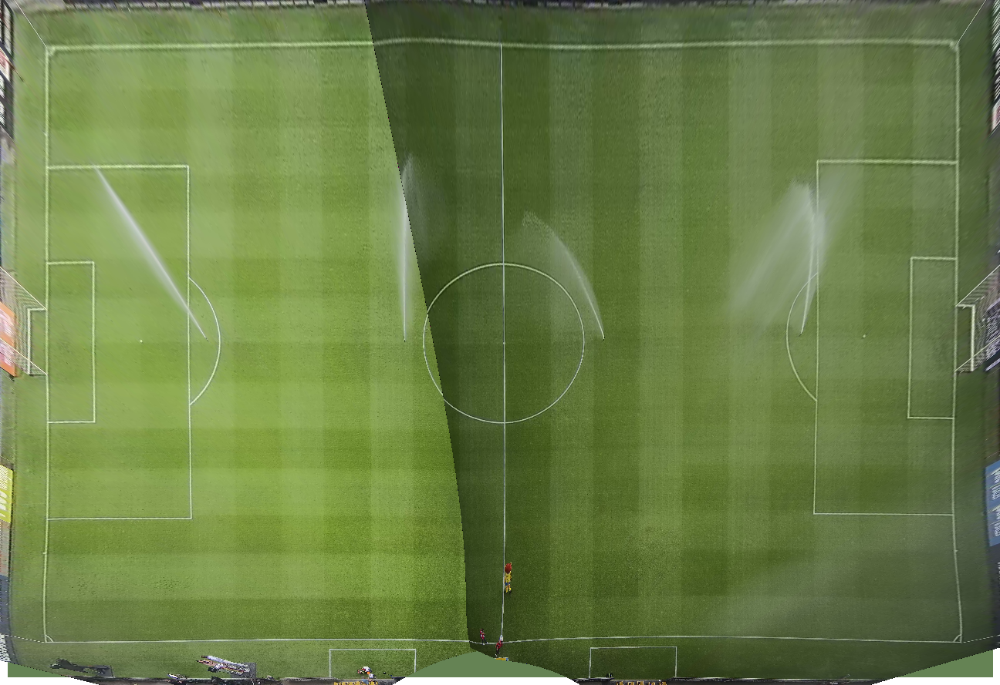

# Configuration Tool

The tool has three tabs.

### Config generation (#3)

Needs to output a configuration file that can be used by the main program. Other parameters to configure are:
- Nr of cameras
- Detection parameters
  - Yolo Model
  - Used image size
- Device that needs to be used (gpu/cpu)
- Pitch dimensions (the actual size of the pitch: x meters on y meters)
- Camera parameters
  - Position (center/top-left/bottom-right/...)
  - Time correction (how much seconds this camera is behind others, one camera is 0 and will be used as a reference)
  - Time format (linked to the filenames of this camera, default is `"%Y%m%d-%H%M%S"`)
  - Path to the files (default is its position)
- 2D field model parameters
  - Path to the file -> this can be auto generated using a python library
  - Coordinate of the left top corner of the pitch on the 2D field
  - Coordinate of the bottom right corner of the pitch on the 2D field
- Output parameters
  - dimensions of the output video (per camera, so if 960x540 and 2 cameras -> the eventual result will be 1920x540)
  - path to where all outputs will be saved
  - Fps of the processing
- Timestamps
  - Format (default is `"%Y-%m-%d %H:%M:%S"`) -> Set by the config tool
  - Start of the game
  - End of the game
- Debug parameters
  - Visualize (Creates videos if true)
- Tracker type (`none`, `team`, `one`, `cam`)
- Team Detector parameters
  - Type (`frameless`, `relational`)
  - Model name
  - Use HSL format (boolean)
  - Use old dual head model (boolean)
- Home team RGB color
- Away team RGB color

Next to that:
- Options/buttons to export these parameters to a json file (inclusive the ones from below).
- Options to turn off some parameters (they have defaults in the software and should not always be configured.)

Example of such a configuration file:
[config_example.json](images/config_example.json)

### Camera calibration (#1)

Here you can do all actions that are related to one camera. Some extra useful features are:
- Need to be able to zoom on a part of the image (separately for the reference image and the 2D field)
- Need to be able to select which camera to work on
- Need a good way to get video data from the camera (video on BLOB? Saving screenshots somewhere?)
- Resolution of the camera needs to be added to the config file

Example of an original image from a camera:

#### Projection using Homography (Marking/dragging of points)

All the following applies to both the reference image and the 2D field.
- Starting with four points practically in the corners of the image.
- Ability of dragging the points
- Image constantly updates -> see "real time" the effect of the homography

Points on the image          |  Points on the 2D field
:-------------------------:|:-------------------------:
 | 

#### Undistortion

- Dragging/editing of distortion parameters
  - Slidebar
  - Value typing
  - Setting max and min of slidebar
  - (Setting the stride of the slidebar)
- Image constantly updates -> see "real time" the effect of the undistortion

Before Undistortion:

After Undistortion:

#### Marking of pitch

We need to know what part of the image is inside the pitch (cyan), 
what part is outside (yellow) the pitch and what is not part of the pitch.
- Marking of polygons, would be nice to be able to:
  - Drag points to change their position
  - Add a points in specific locations between two already existing points
  - Remove a point

#### Marking of the crops

Crops are boxes which create a part of the image, this is needed for improved detections.
- Marking of the crops (only rectangles), would be nice to be able to:
  - Drag points to change their position
  - Drag the whole rectangle to change its position
- Ability to press a button that runs an auto generate crops algorithm
  - This script exists in python, might thus be needed to translate it, or run it in backend
  - The script makes use of outerfield points, so they need to be set before this can be used.

### Calibration overview (#2)

Shows the result of all cameras combined, so it shows all cameras projected/undistorted on the 2D pitch.
- Ability to turn a camera on and off
- Show only the outerfield polygon part of the image on the pitch
- Show the different cameras with a alpha/see-through/transparency effect,
  so that it can be easily seen if the overlapping parts fit with each other.
- Indicate the order of the cameras (which one lays on top, which one is behind)

[//]: # (## Manual Correction Tool)

[//]: # (TBD)